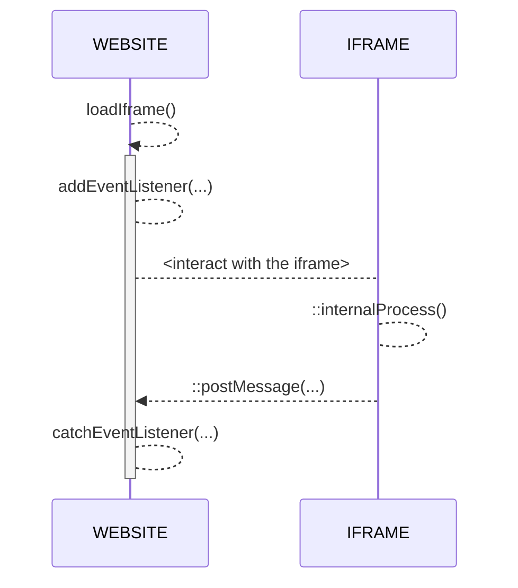

# Tchek SSO/WEB_SDK
Hi! Welcome to Tchek Web SDK Documentation.

Our WebApp includes a number of modules that are available as widgets that can be easily integrated into an iframe. These widgets allow developers to access the full range of features and functionality provided by the ALTO AI platform.
To use these widgets, you will need to generate a temporary permission token. This token will allow you to access the widget for a specified period of time, after which the token will expire and you will need to generate a new one. 

*_Supported languages: `FR`|`EN`|`DE`_

## How Does It Work ?
There are two ways to access to the web app :
- by `/auth/login` global route (to access the Tchek Hub)
- by `https://webapp.tchek.fr/[language]/services/TXXXXXX/[FEAT]` route with your unique temporary access token to access the shoot-inspect or Fast Track. 

With the temporary access token, you will be automatically redirected to the first page you have access to, depending on the inspection progress.
Access to features are customizable per token :

|FEAT				|LOGIN							|SSO							|
|-------------------|-------------------------------|------------------------------|
|Shoot-Inspect   	|Always							|only if enabled on token		|
|Fast-Track      	|Always							|only if enabled on token		|
|Report          	|Always							|only if enabled on token 		|

 It's recommended to use the SDK in an iframe

## Generate SSO token

Get your unique temporary token by using the following request
````
curl --location --request POST 'https://alto.tchek.fr/apiV1/tokenmanager/token' \
--header 'X-API-Key: <PERSONAL_API_TOKEN>' \
--header 'Content-Type: application/json' \
--data-raw '{
    "validity" : ∞, // in days
    "tchekId" : "xXxXXxXXxx", // empty if new self inspection token
    "options" : {
        "shootInspect" : true,
        "fastTrack" : true,
        "report" : true,
	"cost" : false,
        "downloadRoi" : false
    },
    "tradeIn" : {
        "tradeinVehicle" : true, // optional if not using the Hub, but recommended. 
        "immat" : "DJ624RS", // optional if not using the Hub
        "sendingType" : 0 // optional if not using using the Hub: send an automated message with self-inspection link (0: Email | 1: SMS, | 2: Email + SMS, | null: no message sent). Requires setup from Tchek.
    },
    "customer" : {
	"clientType": "customer",
	"email": "john.doe@company.io",
	"firstname": "john",
	"gender":  null,
	"lastname":  "doe",
	"phone":  "0033601020304"
    }
}'
````
````
/* curl response example */
{
  "uid": "T000042",
  "expired": false,
  "expiresIn": "01 Jan 2100 at 10:10:10 UTC",
  "options": "{"shootInspect": true, "fastTrack": true, "report": true, "cost": false, "downloadRoi": false}"
}
````

## Generate Report Url
To access to a specific web report for an inspection, set the tchekId in request and use the `uid` object from response to build the url
````
https://webapp.tchek.ai/<lang>/report?token=T010203
````

## Usage WEB SDK

Install modules
````
npm install
````

Run demo after replacing `<TXXXXXX>` with your personal sso token uid in `/index.html`
````
npm run start
````

### Events
At the end of any step, you'll receive an **event message** from the application.
In Vanilla Javascript, you can use the native **event listener** for catching every event returned by the iframe :
````
document.addEventListener("DOMContentLoaded", function () {
     window.addEventListener("message", function (e) {
         console.log(JSON.parse(e.data));
     });
 });
````
````
/* console.log(data) */
{
    "status": 200,
    "message": "Tchek successfully created !",
    "date": 1652050366222,
    "tchek": {
        "tchek": {...},
        "damages": [...],
        "images": [...],
        "thirdPartyReport": {...}
    }
}
````

### Diagram



### Links
[WEB SDK website](https://webapp.tchek.fr/en/pwa/home)

[API Documentation](https://alto.tchek.fr/api-docs)
